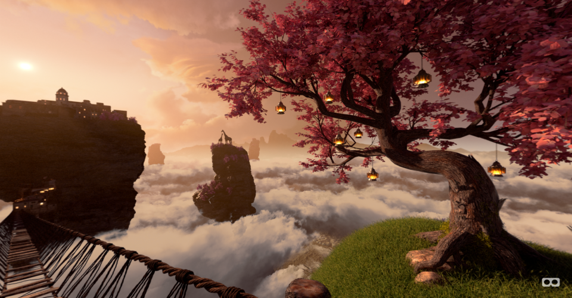

# Winners of OTOY's "Render the Metaverse" Contest

  

Displaying the winning stereoscopic cubemaps with A-Frame. Tested and working on Vive.

## Notes

Getting these to display properly took a bit of effort. The source images are easy enough to find on OTOY's site, but they are in "double" horizontal cubemap format (i.e. first six cube faces are left, second six are right). At least, I think they are (I could not find any official description of the format).

Since the [cubemap component](https://github.com/bryik/aframe-cubemap-component) only accepts six individual images, I had to break the source images up. Furthermore, each tile is horizontally flipped for some reason. I did not notice this until loading it up and seeing the stereo effect broken and text mirrored. There are probably clever ways of dealing with this, but I opted to go the simple route of manual processing with [Imagemagick](http://www.imagemagick.org/script/index.php).

From the source file "pano.png", the command:

    magick convert pano.png -crop 12x1@ +repage +adjoin -flop pano_%d.png

crops the source into 12 equal pieces and 'flops' them (horizontal flip). At this point I made the mistake of renaming each file to match the scheme used by the cubemap component. I realize now that it would have been easier to change the cubemap component's scheme instead. Note that the first image in the set is the **negative-x** face (not the positive), the rest of each set is as expected.

## References

**A-Frame Components:**

- [stereocam](https://github.com/bryik/stereo-panorama-viewer/blob/316d4a485b3b24b30f655b09d08c05777f268a10/public/aframe-components/aframe-stereocam-component.js)
- [Cubemap](https://github.com/bryik/aframe-cubemap-component)

**Cubemaps:**

1. Imagined Reality by Benjamin Aguillon

2. Education Channel by Simon Martin Novak

3. Fushimi Inari Forest by Riccardo Minervino

Thanks to [Oculus](https://www.oculus.com/) and [OTOY](https://home.otoy.com/) for sponsoring [the contest](https://home.otoy.com/vr-competition/)!

### Local Viewing

To install the Node dependencies:

    npm install

To serve the site from a simple Node development server:

    npm start

Then launch the site from your favourite browser:

[**http://localhost:3000/**](http://localhost:3000/)

If you wish to serve the site from a different port:

    PORT=8000 npm start
